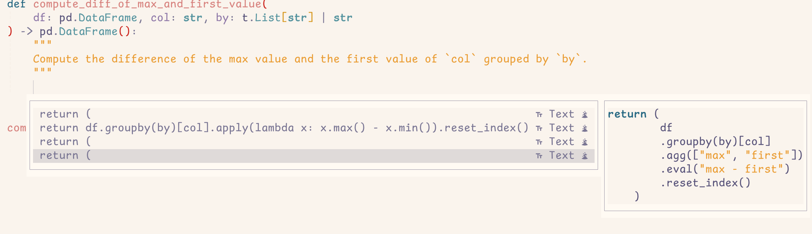

- [Minuet AI](#minuet-ai)
- [Features](#features)
- [Requirements](#requirements)
- [Installation](#installation)
- [Configuration](#configuration)
- [API Keys](#api-keys)
- [System Prompt](#system-prompt)
- [Providers](#providers)
  - [OpenAI](#openai)
  - [Claude](#claude)
  - [Codestral](#codestral)
  - [Gemini](#gemini)
  - [OpenAI-compatible](#openai-compatible)
  - [OpenAI-FIM-compatible](#openai-fim-compatible)
  - [Huggingface](#huggingface)
- [FAQ](#faq)
  - [Customize `cmp` ui](#customize-cmp-ui)
  - [Integration with `lazyvim`](#integration-with-lazyvim)
- [TODO](#todo)
- [Contributing](#contributing)
- [Acknowledgement](#acknowledgement)

# Minuet AI

Minuet AI: Dance with Intelligence in Your Code 💃.

`Minuet-ai` integrates with `nvim-cmp`, brings the grace and harmony of a
minuet to your coding process. Just as dancers move during a minuet.

# Features

- AI-powered code completion
- Support for multiple AI providers (OpenAI, Claude, Gemini, Codestral,
  Huggingface, and OpenAI-compatible services)
- Customizable configuration options



# Requirements

- Neovim 0.10+.
- [plenary.nvim](https://github.com/nvim-lua/plenary.nvim)
- [nvim-cmp](https://github.com/hrsh7th/nvim-cmp)
- An API key for at least one of the supported AI providers

# Installation

Lazy

```lua
specs = {
    {
        'milanglacier/minuet-ai.nvim',
        config = function()
            require('minuet').setup {
                -- Your configuration options here
            }
        end
    },
    { 'nvim-lua/plenary.nvim' },
    { 'hrsh7th/nvim-cmp' },
}


-- If you wish to invoke completion manually,
-- The following configuration binds `A-y` key
-- to invoke the configuration manually.
require('cmp').setup {
    mapping = cmp.mapping.preset.insert({
        ["A-y"] = require('minuet').make_cmp_map()
    }),
}
```

Given the response speed and rate of LLM services, we recommend you invoke
`minuet` completion manually. But you can also add `minuet` into source of
`nvim-cmp`, in this case, completion from `minuet` will pop up automatically.

```lua
require('cmp').setup {
    sources = {
        {
            { name = 'minuet' },
            -- and your other sources
        }
    },
    performance = {
        -- It is recommended to increase the timeout duration due to
        -- the typically slower response speed of LLMs compared to
        -- other completion sources. While this adjustment is
        -- automatically handled in manual completion mode by Minuet,
        -- you need to configure this option yourself when using
        -- auto-completion mode.
        fetching_timeout = 2000,
    },
}
```

If you are using a distribution like `lazyvim`, see the FAQ section to see how
to configure `minuet` with `lazyvim`, note that the author does not use
`lazyvim`, the FAQ section does not guarantee to work. PRs are welcome to fix
the problem if it exists.

# Configuration

Minuet AI comes with the following defaults:

```lua
default_config = {
    provider = 'codestral',
    -- the maximum total characters of the context before and after cursor.
    -- Note that this does not count tokens but simply characters. 12800
    -- characters are usually counted around 4000 tokens.
    context_window = 12800,
    context_ratio = 0.6,
    -- when the total characters exceed the context window, the ratio of
    -- context before cursor and after cursor, the larger the ratio the more
    -- context before cursor will be used.
    throttle = 1000, -- only send the request every x milliseconds, use 0 to disable throttle.
    -- debounce the request in x milliseconds, set to 0 to disable debounce
    debounce = 400,
    -- show notification when request is sent or request fails. options:
    -- `false` to disable notification, "verbose" to show notification when
    -- request is sent or request fails. "error" to show notification when
    -- request failed.
    notify = 'verbose',
    request_timeout = 3, -- the timeout of the request in seconds
    -- if completion item has multiple lines, create another completion item only containing its first line.
    add_single_line_entry = true,
    -- The number of completion items (encoded as part of the prompt for the
    -- chat LLM) requested from the language model. It's important to note that
    -- when 'add_single_line_entry' is set to true, the actual number of
    -- returned items may exceed this value. Additionally, the LLM cannot
    -- guarantee the exact number of completion items specified, as this
    -- parameter serves only as a prompt guideline.
    n_completions = 3,
    provider_options = {
        -- see the documentation in each provider in the following part.
    },
    -- see the documentation in the `System Prompt` section
    default_template = {
        template = '...',
        prompt = '...',
        guidelines = '...',
        n_completion_template = '...',
    },
}
```

# API Keys

Minuet AI requires API keys to function. Set the following environment variables:

- `OPENAI_API_KEY` for OpenAI
- `GEMINI_API_KEY` for Gemini
- `ANTHROPIC_API_KEY` for Claude
- `CODESTRAL_API_KEY` for Codestral
- `HF_API_KEY` for Huggingface
- Custom environment variable for OpenAI-compatible services (as specified in your configuration)

# System Prompt

See [prompt](./prompt.md) for the default system prompt used by `minuet`.

The default system prompt template is:

```lua
system = {
    template = function() return default_config.default_template.template end,
    prompt = function() return default_config.default_template.prompt end,
    guidelines = function() return default_config.default_template.guidelines end,
    n_completion_template = function() return default_config.default_template.n_completion_template end,
}
```

You can adjust the `template` by encoding any placeholdes inside the three
braces, the placeholders will be interpolated from the key/value in this table.
The value can be a string or a function that takes no argument and returns a
string.

```lua
system = {
    template = '{{{assistant}}}\n{{{role}}}'
    assistant = function() return 'you are a helpful assistant' end,
    role = "you are also a code expert.",
}
```

Note that `n_completion_template` is a special placeholder as it contains one
`%d` which will be encoded with `config.n_completions`, if you want to
customize this template, make sure your prompt also contains only one `%d`.

# Providers

## OpenAI

the following is the default configuration for OpenAI:

```lua
provider_options = {
    openai = {
        model = 'gpt-4o-mini',
        system = system,
        few_shots = default_fewshots,
        optional = {
            -- pass any additional parameters you want to send to OpenAI request,
            -- e.g.
            -- stop = { 'end' },
            -- max_tokens = 256,
            -- top_p = 0.9,
        },
    },
}
```

The following configuration is not the default, but recommended to prevent
request timeout from outputing too many tokens.

```lua
provider_options = {
    openai = {
        optional = {
            max_tokens = 256,
        },
    },
}
```

## Claude

the following is the default configuration for Claude:

```lua
provider_options = {
    claude = {
        max_tokens = 512,
        model = 'claude-3-5-sonnet-20240620',
        system = system,
        few_shots = default_fewshots,
        optional = {
            -- pass any additional parameters you want to send to claude request,
            -- e.g.
            -- stop_sequences = nil,
        },
    },
}
```

## Codestral

Codestral is a text completion model, not a chat model, so the system prompt
and few shot examples does not apply. Note that you should use the
`CODESTRAL_API_KEY`, not the `MISTRAL_API_KEY`, as they are using different
endpoint. To use the Mistral endpoint, simply modify the `end_point` and
`api_key` parameters in the configuration.

the following is the default configuration for Codestral:

```lua
provider_options = {
    codestral = {
        model = 'codestral-latest',
        end_point = 'https://codestral.mistral.ai/v1/fim/completions',
        api_key = 'CODESTRAL_API_KEY',
        optional = {
            stop = nil, -- the identifier to stop the completion generation
            max_tokens = nil,
        },
    },
}
```

The following configuration is not the default, but recommended to prevent
request timeout from outputing too many tokens.

```lua
provider_options = {
    codestral = {
        optional = {
            max_tokens = 256,
            stop = { '\n\n' },
        },
    },
}
```

## Gemini

The following config is the default.

```lua
provider_options = {
    gemini = {
        model = 'gemini-1.5-flash-latest',
        system = system,
        few_shots = default_fewshots,
        optional = {
            -- generationConfig = {
            --     stopSequences = {},
            --     maxOutputTokens = 256,
            --     topP = 0.8,
            -- },
        },
    },
}
```

The following configuration is not the default, but recommended to prevent
request timeout from outputing too many tokens.

```lua
provider_options = {
    gemini = {
        optional = {
            generationConfig = {
                maxOutputTokens = 256,
            },
        },
    },
}
```

## OpenAI-compatible

Use any providers compatible with OpenAI's chat completion API.

The following config is the default.

```lua
provider_options = {
    openai_compatible = {
        model = 'open-mistral-nemo',
        system = system,
        few_shots = default_fewshots,
        end_point = 'https://api.mistral.ai/v1/chat/completions',
        api_key = 'MISTRAL_API_KEY',
        name = 'Mistral',
        optional = {
            stop = nil,
            max_tokens = nil,
        },
    }
}
```

## OpenAI-FIM-compatible

Use any provider compatible with OpenAI's completion API. This request uses the
text completion API, not chat completion, so system prompts and few-shot
examples are not applicable.

Refer to the [Completions
Legacy](https://platform.openai.com/docs/api-reference/completions) section of
the OpenAI documentation for details.

```lua
provider_options = {
    openai_fim_compatible = {
        model = 'deepseek-coder',
        end_point = 'https://api.deepseek.com/beta/completions',
        api_key = 'DEEPSEEK_API_KEY',
        name = 'Deepseek',
        optional = {
            stop = nil,
            max_tokens = nil,
        },
    }
}
```

The following configuration is not the default, but recommended to prevent
request timeout from outputing too many tokens.

```lua
provider_options = {
    openai_fim_compatible = {
        optional = {
            max_tokens = 256,
            stop = { '\n\n' },
        },
    },
}
```

## Huggingface

Currently only text completion model in huggingface is supported, so the system
prompt and few shot examples does not apply.

```lua
provider_options = {
    huggingface = {
        end_point = 'https://api-inference.huggingface.co/models/bigcode/starcoder2-3b',
        type = 'completion',
        strategies = {
            completion = {
                markers = {
                    prefix = '<fim_prefix>',
                    suffix = '<fim_suffix>',
                    middle = '<fim_middle>',
                },
                strategy = 'PSM', -- PSM, SPM or PM
            },
        },
        optional = {
            parameters = {
                -- The parameter specifications for different LLMs may vary.
                -- Ensure you specify the parameters after reading the API
                -- documentation.
                stop = nil,
                max_tokens = nil,
                do_sample = nil,
            },
        },
    },
}
```

# FAQ

## Customize `cmp` ui

You can configure the icons of `minuet` by using the following snippet
(referenced from [cmp's
wiki](https://github.com/hrsh7th/nvim-cmp/wiki/Menu-Appearance#basic-customisations)):

```lua
local cmp = require('cmp')
cmp.setup {
  formatting = {
    format = function(entry, vim_item)
      -- Kind icons
      vim_item.kind = string.format('%s %s', kind_icons[vim_item.kind], vim_item.kind) -- This concatenates the icons with the name of the item kind
      -- Source
      vim_item.menu = ({
        minuet = "󱗻"
      })[entry.source.name]
      return vim_item
    end
  },
}
```

## Integration with `lazyvim`

```lua
{
    'milanglacier/minuet-ai.nvim',
    config = function()
        require('minuet').setup {
            -- Your configuration options here
        }
    end
},
{ 'nvim-lua/plenary.nvim' },
{
    'nvim-cmp',
    opts = function(_, opts)
        -- if you wish to use autocomplete
        table.insert(opts.sources, 1, {
            name = 'minuet',
            group_index = 1,
            priority = 100
        })

        -- if you wish to use manual complete
        opts.mapping = cmp.mapping.preset.insert(vim.tbl_deep_extend('force', opts.mapping, {
            ['<A-y>'] = require('minuet').make_cmp_map()
        }))
    end,
}
```

# TODO

1. Implement `RAG` on the codebase and encode the codebase information into the request to LLM.
2. Add `stream` support and return partial results when request timeout.
3. Virtual text UI support.

# Contributing

Contributions are welcome! Please feel free to submit a Pull Request.

# Acknowledgement

- [cmp-ai](https://github.com/tzachar/cmp-ai): A large piece of the codebase are based on this plugin.
- [continue.dev](https://www.continue.dev): not a neovim plugin, but I find a lot LLM models from here.
