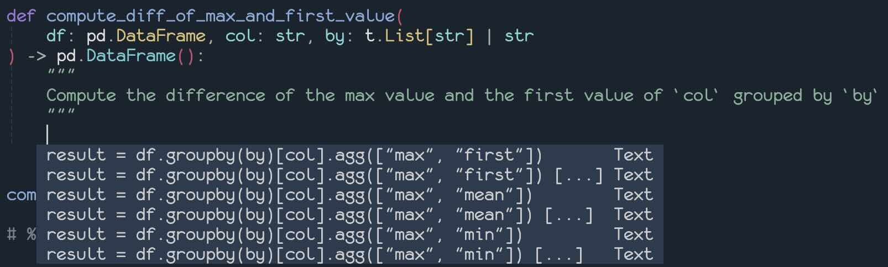

- [Minuet](#minuet)
- [Features](#features)
- [Requirements](#requirements)
- [Installation](#installation)
- [Quick Start](#quick-start)
  - [Virtual Text Setup](#virtual-text-setup)
  - [Nvim-cmp setup](#nvim-cmp-setup)
  - [Blink-cmp Setup](#blink-cmp-setup)
  - [Built-in Completion, Mini.Completion, and LSP Setup](#built-in-completion-minicompletion-and-lsp-setup)
  - [LLM Provider Examples](#llm-provider-examples)
    - [Openrouter Kimi-K2](#openrouter-kimi-k2)
    - [Deepseek](#deepseek)
    - [Ollama Qwen-2.5-coder:7b](#ollama-qwen-25-coder7b)
    - [Llama.cpp Qwen-2.5-coder:1.5b](#llamacpp-qwen-25-coder15b)
- [Selecting a Provider or Model](#selecting-a-provider-or-model)
  - [Understanding Model Speed](#understanding-model-speed)
- [Configuration](#configuration)
- [API Keys](#api-keys)
- [Prompt](#prompt)
- [Providers](#providers)
  - [OpenAI](#openai)
  - [Claude](#claude)
  - [Codestral](#codestral)
  - [Gemini](#gemini)
  - [OpenAI-compatible](#openai-compatible)
  - [OpenAI-FIM-compatible](#openai-fim-compatible)
    - [Non-OpenAI-FIM-Compatible APIs](#non-openai-fim-compatible-apis)
- [Commands](#commands)
  - [`Minuet change_provider`, `Minuet change_model`](#minuet-change_provider-minuet-change_model)
  - [`Minuet change_preset`](#minuet-change_preset)
  - [`Minuet blink`, `Minuet cmp`](#minuet-blink-minuet-cmp)
  - [`Minuet virtualtext`](#minuet-virtualtext)
  - [`Minuet lsp`](#minuet-lsp)
- [API](#api)
  - [Virtual Text](#virtual-text)
  - [Lualine](#lualine)
  - [Minuet Event](#minuet-event)
- [FAQ](#faq)
  - [Customize `cmp` ui for source icon and kind icon](#customize-cmp-ui-for-source-icon-and-kind-icon)
  - [Customize `blink` ui for source icon and kind icon](#customize-blink-ui-for-source-icon-and-kind-icon)
  - [Significant Input Delay When Moving to a New Line with `nvim-cmp`](#significant-input-delay-when-moving-to-a-new-line-with-nvim-cmp)
  - [Integration with `lazyvim`](#integration-with-lazyvim)
- [Enhancement](#enhancement)
  - [RAG (Experimental)](#rag-experimental)
- [Troubleshooting](#troubleshooting)
- [Contributing](#contributing)
- [Acknowledgement](#acknowledgement)

# Minuet

Minuet: Dance with Intelligence in Your Code 💃.

`Minuet` brings the grace and harmony of a minuet to your coding process.
Just as dancers move during a minuet.

# Features

- AI-powered code completion with dual modes:
  - Specialized prompts and various enhancements for chat-based LLMs on code completion tasks.
  - Fill-in-the-middle (FIM) completion for compatible models (DeepSeek,
    Codestral, Qwen, and others).
- Support for multiple AI providers (OpenAI, Claude, Gemini, Codestral, Ollama,
  Llama-cpp, and OpenAI-compatible services).
- Customizable configuration options.
- Streaming support to enable completion delivery even with slower LLMs.
- No proprietary binary running in the background. Just curl and your preferred LLM provider.
- Support `virtual-text`, `nvim-cmp`, `blink-cmp`, `built-in`,
  `mini.completion` frontend.
- Act as an **in-process LSP** server to provide completions (opt-in feature).

**With nvim-cmp / blink-cmp frontend**:


**With builtin completion frontend** (requires nvim 0.11+):



**With virtual text frontend**:


# Requirements

- Neovim 0.10+.
- [plenary.nvim](https://github.com/nvim-lua/plenary.nvim)
- optional: [nvim-cmp](https://github.com/hrsh7th/nvim-cmp)
- optional: [blink.cmp](https://github.com/Saghen/blink.cmp)
- An API key for at least one of the supported AI providers

# Installation

**Lazy.nvim**:

```lua
specs = {
    {
        'milanglacier/minuet-ai.nvim',
        config = function()
            require('minuet').setup {
                -- Your configuration options here
            }
        end,
    },
    { 'nvim-lua/plenary.nvim' },
    -- optional, if you are using virtual-text frontend, nvim-cmp is not
    -- required.
    { 'hrsh7th/nvim-cmp' },
    -- optional, if you are using virtual-text frontend, blink is not required.
    { 'Saghen/blink.cmp' },
}
```

**Rocks.nvim**:

`Minuet` is available on luarocks.org. Simply run `Rocks install minuet-ai.nvim` to install it like any other luarocks package.

# Quick Start

## Virtual Text Setup

```lua
require('minuet').setup {
    virtualtext = {
        auto_trigger_ft = {},
        keymap = {
            -- accept whole completion
            accept = '<A-A>',
            -- accept one line
            accept_line = '<A-a>',
            -- accept n lines (prompts for number)
            -- e.g. "A-z 2 CR" will accept 2 lines
            accept_n_lines = '<A-z>',
            -- Cycle to prev completion item, or manually invoke completion
            prev = '<A-[>',
            -- Cycle to next completion item, or manually invoke completion
            next = '<A-]>',
            dismiss = '<A-e>',
        },
    },
}
```

## Nvim-cmp setup

<details>

```lua
require('cmp').setup {
    sources = {
        {
             -- Include minuet as a source to enable autocompletion
            { name = 'minuet' },
            -- and your other sources
        }
    },
    performance = {
        -- It is recommended to increase the timeout duration due to
        -- the typically slower response speed of LLMs compared to
        -- other completion sources. This is not needed when you only
        -- need manual completion.
        fetching_timeout = 2000,
    },
}


-- If you wish to invoke completion manually,
-- The following configuration binds `A-y` key
-- to invoke the configuration manually.
require('cmp').setup {
    mapping = {
        ["<A-y>"] = require('minuet').make_cmp_map()
        -- and your other keymappings
    },
}
```

</details>

## Blink-cmp Setup

<details>

```lua
require('blink-cmp').setup {
    keymap = {
        -- Manually invoke minuet completion.
        ['<A-y>'] = require('minuet').make_blink_map(),
    },
    sources = {
         -- Enable minuet for autocomplete
        default = { 'lsp', 'path', 'buffer', 'snippets', 'minuet' },
        -- For manual completion only, remove 'minuet' from default
        providers = {
            minuet = {
                name = 'minuet',
                module = 'minuet.blink',
                async = true,
                -- Should match minuet.config.request_timeout * 1000,
                -- since minuet.config.request_timeout is in seconds
                timeout_ms = 3000,
                score_offset = 50, -- Gives minuet higher priority among suggestions
            },
        },
    },
    -- Recommended to avoid unnecessary request
    completion = { trigger = { prefetch_on_insert = false } },
}
```

</details>

## Built-in Completion, Mini.Completion, and LSP Setup

<details>

**Requirements:**

- Neovim version 0.11 or higher is necessary for built-in completion.

```lua
require('minuet').setup {
    lsp = {
        enabled_ft = { 'toml', 'lua', 'cpp' },
        -- Enables automatic completion triggering using `vim.lsp.completion.enable`
        enabled_auto_trigger_ft = { 'cpp', 'lua' },
    }
}
```

The `enabled_auto_trigger_ft` setting is relevant only for built-in completion.
`Mini.Completion` users can ignore this option, as Mini.Completion uses **all**
available LSPs for **auto-triggered** completion.

For manually triggered completion, ensure `vim.bo.omnifunc` is set to
`v:lua.vim.lsp.omnifunc` and use `<C-x><C-o>` in Insert mode.

**Recommendation:**

For users of `blink-cmp` and `nvim-cmp`, it is recommended to use the native
source rather than through LSP for two main reasons:

1. `blink-cmp` and `nvim-cmp` offer better sorting and async management when
   Minuet is utilized as a separate source rather than alongside a regular LSP
   such as `clangd`.
2. With `blink-cmp` and `nvim-cmp` native sources, it's possible to configure
   Minuet for manual completion only, disabling automatic completion. However,
   when Minuet operates as an LSP server, it is impossible to determine whether
   completion is triggered automatically or manually.

   The LSP protocol specification defines three `triggerKind` values:
   `Invoked`, `TriggerCharacter`, and `TriggerForIncompleteCompletions`.
   However, none of these specifically differentiates between manual and
   automatic completion requests.

**Note**: An upstream issue ([tracked
here](https://github.com/neovim/neovim/issues/32972)) may cause unexpected
indentation behavior when accepting multi-line completions.

Currently, Minuet offers the config option `config.lsp.adjust_indentation`
(enabled by default) as a temporary workaround. However, the author
acknowledges that this solution is incomplete and may introduce additional edge
cases when enabled.

Therefore, consider the following practices when using built-in completion:

1. Ensure `config.add_single_line_entry = true` and only accept single-line completions.
2. Avoid using Minuet and built-in completion with languages where indentation
   affects semantics, such as Python.

**Additional Note:**

Users might call `vim.lsp.completion.enable {autotrigger = true}` during the
`LspAttach` event when the client supports completion. However, this is not the
desired behavior for Minuet. As an LLM completion source, Minuet can face
significant rate limits during automatic triggering.

Therefore, it's recommended to enable Minuet for automatic triggering using the
`config.lsp.enabled_auto_trigger_ft` setting.

For users who uses `LspAttach` event, it is recommeded to verify that the
server is not the Minuet server before enabling autotrigger. An example
configuration is shown below:

```lua
vim.api.nvim_create_autocmd('LspAttach', {
    callback = function(args)
        local client_id = args.data.client_id
        local bufnr = args.buf
        local client = vim.lsp.get_client_by_id(client_id)
        if not client then
            return
        end

        if client.server_capabilities.completionProvider and client.name ~= 'minuet' then
            vim.lsp.completion.enable(true, client_id, bufnr, { autotrigger = true })
        end
    end,
    desc = 'Enable built-in auto completion',
})
```

</details>

## LLM Provider Examples

### Openrouter Kimi-K2

<details>

```lua
require('minuet').setup {
    provider = 'openai_compatible',
    request_timeout = 2.5,
    throttle = 1500, -- Increase to reduce costs and avoid rate limits
    debounce = 600, -- Increase to reduce costs and avoid rate limits
    provider_options = {
        openai_compatible = {
            api_key = 'OPENROUTER_API_KEY',
            end_point = 'https://openrouter.ai/api/v1/chat/completions',
            model = 'moonshotai/kimi-k2',
            name = 'Openrouter',
            optional = {
                max_tokens = 56,
                top_p = 0.9,
                provider = {
                     -- Prioritize throughput for faster completion
                    sort = 'throughput',
                },
            },
        },
    },
}
```

</details>

### Deepseek

<details>

```lua
-- you can use deepseek with both openai_fim_compatible or openai_compatible provider
require('minuet').setup {
    provider = 'openai_fim_compatible',
    provider_options = {
        openai_fim_compatible = {
            api_key = 'DEEPSEEK_API_KEY',
            name = 'deepseek',
            optional = {
                max_tokens = 256,
                top_p = 0.9,
            },
        },
    },
}


-- or
require('minuet').setup {
    provider = 'openai_compatible',
    provider_options = {
        openai_compatible = {
            end_point = 'https://api.deepseek.com/chat/completions',
            api_key = 'DEEPSEEK_API_KEY',
            name = 'deepseek',
            optional = {
                max_tokens = 256,
                top_p = 0.9,
            },
        },
    },
}
```

</details>

### Ollama Qwen-2.5-coder:7b

<details>

```lua
require('minuet').setup {
    provider = 'openai_fim_compatible',
    n_completions = 1, -- recommend for local model for resource saving
    -- I recommend beginning with a small context window size and incrementally
    -- expanding it, depending on your local computing power. A context window
    -- of 512, serves as an good starting point to estimate your computing
    -- power. Once you have a reliable estimate of your local computing power,
    -- you should adjust the context window to a larger value.
    context_window = 512,
    provider_options = {
        openai_fim_compatible = {
            -- For Windows users, TERM may not be present in environment variables.
            -- Consider using APPDATA instead.
            api_key = 'TERM',
            name = 'Ollama',
            end_point = 'http://localhost:11434/v1/completions',
            model = 'qwen2.5-coder:7b',
            optional = {
                max_tokens = 56,
                top_p = 0.9,
            },
        },
    },
}
```

</details>

### Llama.cpp Qwen-2.5-coder:1.5b

<details>

First, launch the `llama-server` with your chosen model.

Here's an example of a bash script to start the server if your system has less
than 8GB of VRAM:

```bash
llama-server \
    -hf ggml-org/Qwen2.5-Coder-1.5B-Q8_0-GGUF \
    --port 8012 -ngl 99 -fa -ub 1024 -b 1024 \
    --ctx-size 0 --cache-reuse 256
```

```lua
require('minuet').setup {
    provider = 'openai_fim_compatible',
    n_completions = 1, -- recommend for local model for resource saving
    -- I recommend beginning with a small context window size and incrementally
    -- expanding it, depending on your local computing power. A context window
    -- of 512, serves as an good starting point to estimate your computing
    -- power. Once you have a reliable estimate of your local computing power,
    -- you should adjust the context window to a larger value.
    context_window = 512,
    provider_options = {
        openai_fim_compatible = {
            -- For Windows users, TERM may not be present in environment variables.
            -- Consider using APPDATA instead.
            api_key = 'TERM',
            name = 'Llama.cpp',
            end_point = 'http://localhost:8012/v1/completions',
            -- The model is set by the llama-cpp server and cannot be altered
            -- post-launch.
            model = 'PLACEHOLDER',
            optional = {
                max_tokens = 56,
                top_p = 0.9,
            },
            -- Llama.cpp does not support the `suffix` option in FIM completion.
            -- Therefore, we must disable it and manually populate the special
            -- tokens required for FIM completion.
            template = {
                prompt = function(context_before_cursor, context_after_cursor, _)
                    return '<|fim_prefix|>'
                        .. context_before_cursor
                        .. '<|fim_suffix|>'
                        .. context_after_cursor
                        .. '<|fim_middle|>'
                end,
                suffix = false,
            },
        },
    },
}
```

**NOTE**: Special tokens such as `<|fim_prefix|>` vary across different models.
The example code provided uses the tokens specific to `Qwen-2.5-coder`. If you
intend to use a different model, ensure the `llama-cpp` template is updated to
reflect the corresponding special tokens for your chosen model.

For additional example bash scripts to run llama.cpp based on your local
computing power, please refer to [recipes.md](./recipes.md).

</details>

# Selecting a Provider or Model

The `gemini-2.0-flash` and `codestral` models offer high-quality output with free
and fast processing. For optimal quality (albeit slower generation speed),
consider using the `deepseek-chat` model, which is compatible with both
`openai-fim-compatible` and `openai-compatible` providers. For local LLM
inference, you can deploy either `qwen-2.5-coder` or `deepseek-coder-v2` through
Ollama using the `openai-fim-compatible` provider.

As of January 28, 2025: Due to high server demand, Deepseek users may
experience significant response delays or timeout. We recommend trying
alternative providers instead.

We **do not** recommend using thinking models, as this mode significantly
increases latency—even with the fastest models. However, if you choose to use
thinking models, please ensure that their thinking capabilities are disabled.
Refer to the following examples for guidance on how to disable the thinking
feature.

## Understanding Model Speed

For cloud-based providers,
[Openrouter](https://openrouter.ai/google/gemini-2.0-flash-001/providers)
offers a valuable resource for comparing the speed of both closed-source and
open-source models hosted by various cloud inference providers.

When assessing model speed, two key metrics are latency (time to first token)
and throughput (tokens per second). Latency is often a more critical factor
than throughput.

Ideally, one would aim for a latency of less than 1 second and a throughput
exceeding 100 tokens per second.

For local LLM,
[llama.cpp#4167](https://github.com/ggml-org/llama.cpp/discussions/4167)
provides valuable data on model speed for 7B models running on Apple M-series
chips. The two crucial metrics are `Q4_0 PP [t/s]`, which measures latency
(tokens per second to process the KV cache, equivalent to the time to generate
the first token), and `Q4_0 TG [t/s]`, which indicates the tokens per second
generation speed.

# Configuration

Minuet AI comes with the following defaults:

```lua
default_config = {
    -- Enable or disable auto-completion. Note that you still need to add
    -- Minuet to your cmp/blink sources. This option controls whether cmp/blink
    -- will attempt to invoke minuet when minuet is included in cmp/blink
    -- sources. This setting has no effect on manual completion; Minuet will
    -- always be enabled when invoked manually. You can use the command
    -- `Minuet cmp/blink toggle` to toggle this option.
    cmp = {
        enable_auto_complete = true,
    },
    blink = {
        enable_auto_complete = true,
    },
    -- LSP is recommended only for built-in completion. If you are using
    -- `cmp` or `blink`, utilizing LSP for code completion from Minuet is *not*
    -- recommended.
    lsp = {
        enabled_ft = {},
        -- Filetypes excluded from LSP activation. Useful when `enabled_ft` = { '*' }
        disabled_ft = {},
        -- Enables automatic completion triggering using `vim.lsp.completion.enable`
        enabled_auto_trigger_ft = {},
        -- Filetypes excluded from autotriggering. Useful when `enabled_auto_trigger_ft` = { '*' }
        disabled_auto_trigger_ft = {},
        -- if true, when the user is using blink or nvim-cmp or built-in pum
        -- menu, warn the user that they should use the native source instead.
        warn_on_blink_or_cmp = true,
        -- See README section [Built-in Completion, Mini.Completion, and LSP
        -- Setup] for more details on this option.
        adjust_indentation = true,
    },
    virtualtext = {
        -- Specify the filetypes to enable automatic virtual text completion,
        -- e.g., { 'python', 'lua' }. Note that you can still invoke manual
        -- completion even if the filetype is not on your auto_trigger_ft list.
        auto_trigger_ft = {},
        -- specify file types where automatic virtual text completion should be
        -- disabled. This option is useful when auto-completion is enabled for
        -- all file types i.e., when auto_trigger_ft = { '*' }
        auto_trigger_ignore_ft = {},
        keymap = {
            accept = nil,
            accept_line = nil,
            accept_n_lines = nil,
            -- Cycle to next completion item, or manually invoke completion
            next = nil,
            -- Cycle to prev completion item, or manually invoke completion
            prev = nil,
            dismiss = nil,
        },
        -- Whether show virtual text suggestion when the completion menu
        -- (nvim-cmp or blink-cmp) is visible.
        show_on_completion_menu = false,
    },
    provider = 'codestral',
    -- the maximum total characters of the context before and after the cursor
    -- 16000 characters typically equate to approximately 4,000 tokens for
    -- LLMs.
    context_window = 16000,
    -- when the total characters exceed the context window, the ratio of
    -- context before cursor and after cursor, the larger the ratio the more
    -- context before cursor will be used. This option should be between 0 and
    -- 1, context_ratio = 0.75 means the ratio will be 3:1.
    context_ratio = 0.75,
    throttle = 1000, -- only send the request every x milliseconds, use 0 to disable throttle.
    -- debounce the request in x milliseconds, set to 0 to disable debounce
    debounce = 400,
    -- Control notification display for request status
    -- Notification options:
    -- false: Disable all notifications (use boolean false, not string "false")
    -- "debug": Display all notifications (comprehensive debugging)
    -- "verbose": Display most notifications
    -- "warn": Display warnings and errors only
    -- "error": Display errors only
    notify = 'warn',
    -- The request timeout, measured in seconds. When streaming is enabled
    -- (stream = true), setting a shorter request_timeout allows for faster
    -- retrieval of completion items, albeit potentially incomplete.
    -- Conversely, with streaming disabled (stream = false), a timeout
    -- occurring before the LLM returns results will yield no completion items.
    request_timeout = 3,
    -- If completion item has multiple lines, create another completion item
    -- only containing its first line. This option only has impact for cmp and
    -- blink. For virtualtext, no single line entry will be added.
    add_single_line_entry = true,
    -- The number of completion items encoded as part of the prompt for the
    -- chat LLM. For FIM model, this is the number of requests to send. It's
    -- important to note that when 'add_single_line_entry' is set to true, the
    -- actual number of returned items may exceed this value. Additionally, the
    -- LLM cannot guarantee the exact number of completion items specified, as
    -- this parameter serves only as a prompt guideline.
    n_completions = 3,
    --  Length of context after cursor used to filter completion text.
    --
    -- This setting helps prevent the language model from generating redundant
    -- text.  When filtering completions, the system compares the suffix of a
    -- completion candidate with the text immediately following the cursor.
    --
    -- If the length of the longest common substring between the end of the
    -- candidate and the beginning of the post-cursor context exceeds this
    -- value, that common portion is trimmed from the candidate.
    --
    -- For example, if the value is 15, and a completion candidate ends with a
    -- 20-character string that exactly matches the 20 characters following the
    -- cursor, the candidate will be truncated by those 20 characters before
    -- being delivered.
    after_cursor_filter_length = 15,
    -- Similar to after_cursor_filter_length but trim the completion item from
    -- prefix instead of suffix.
    before_cursor_filter_length = 2,
    -- proxy port to use
    proxy = nil,
    provider_options = {
        -- see the documentation in each provider in the following part.
    },
    -- see the documentation in the `Prompt` section
    default_system = {
        template = '...',
        prompt = '...',
        guidelines = '...',
        n_completion_template = '...',
    },
    default_system_prefix_first = {
        template = '...',
        prompt = '...',
        guidelines = '...',
        n_completion_template = '...',
    },
    default_fim_template = {
        prompt = '...',
        suffix = '...',
    },
    default_few_shots = { '...' },
    default_chat_input = { '...' },
    default_few_shots_prefix_first = { '...' },
    default_chat_input_prefix_first = { '...' },
    -- Config options for `Minuet change_preset` command
    presets = {}
}
```

# API Keys

Minuet AI requires API keys to function. Set the following environment variables:

- `OPENAI_API_KEY` for OpenAI
- `GEMINI_API_KEY` for Gemini
- `ANTHROPIC_API_KEY` for Claude
- `CODESTRAL_API_KEY` for Codestral
- Custom environment variable for OpenAI-compatible services (as specified in your configuration)

**Note:** Provide the name of the environment variable to Minuet, not the
actual value. For instance, pass `OPENAI_API_KEY` to Minuet, not the value
itself (e.g., `sk-xxxx`).

If using Ollama, you need to assign an arbitrary, non-null environment variable
as a placeholder for it to function.

Alternatively, you can provide a function that returns the API key. This
function should return the result instantly as it will be called for each
completion request.

```lua
require('minuet').setup {
    provider_options = {
        openai_compatible = {
            -- good
            api_key = 'FIREWORKS_API_KEY', -- will read the environment variable FIREWORKS_API_KEY
            -- good
            api_key = function() return 'sk-xxxx' end,
            -- bad
            api_key = 'sk-xxxx',
        }
    }
}
```

# Prompt

See [prompt](./prompt.md) for the default prompt used by `minuet` and
instructions on customization.

Note that `minuet` employs two distinct prompt systems:

1. A system designed for chat-based LLMs (OpenAI, OpenAI-Compatible, Claude,
   and Gemini)
2. A separate system designed for Codestral and OpenAI-FIM-compatible models

# Providers

You need to set the field `provider` in the config, the default provider is
`codestral`. For example:

```lua
require('minuet').setup {
    provider = 'gemini'
}
```

## OpenAI

<details>

the following is the default configuration for OpenAI:

```lua
provider_options = {
    openai = {
        model = 'gpt-4.1-mini',
        end_point = 'https://api.openai.com/v1/chat/completions',
        system = "see [Prompt] section for the default value",
        few_shots = "see [Prompt] section for the default value",
        chat_input = "See [Prompt Section for default value]",
        stream = true,
        api_key = 'OPENAI_API_KEY',
        optional = {
            -- pass any additional parameters you want to send to OpenAI request,
            -- e.g.
            -- stop = { 'end' },
            -- max_tokens = 256,
            -- top_p = 0.9,
            -- reasoning_effort = 'minimal'
        },
    },
}
```

The following configuration is not the default, but recommended to prevent
request timeout from outputing too many tokens.

```lua
provider_options = {
    openai = {
        optional = {
            max_tokens = 256,
            -- for thinking models
            reasoning_effort = 'minimal'
        },
    },
}
```

</details>

## Claude

<details>

the following is the default configuration for Claude:

```lua
provider_options = {
    claude = {
        max_tokens = 256,
        model = 'claude-haiku-4.5',
        system = "see [Prompt] section for the default value",
        few_shots = "see [Prompt] section for the default value",
        chat_input = "See [Prompt Section for default value]",
        stream = true,
        api_key = 'ANTHROPIC_API_KEY',
        end_point = 'https://api.anthropic.com/v1/messages',
        optional = {
            -- pass any additional parameters you want to send to claude request,
            -- e.g.
            -- stop_sequences = nil,
        },
    },
}
```

</details>

## Codestral

<details>

Codestral is a text completion model, not a chat model, so the system prompt
and few shot examples does not apply. Note that you should use the
`CODESTRAL_API_KEY`, not the `MISTRAL_API_KEY`, as they are using different
endpoint. To use the Mistral endpoint, simply modify the `end_point` and
`api_key` parameters in the configuration.

the following is the default configuration for Codestral:

```lua
provider_options = {
    codestral = {
        model = 'codestral-latest',
        end_point = 'https://codestral.mistral.ai/v1/fim/completions',
        api_key = 'CODESTRAL_API_KEY',
        stream = true,
        template = {
            prompt = "See [Prompt Section for default value]",
            suffix = "See [Prompt Section for default value]",
        },
        optional = {
            stop = nil, -- the identifier to stop the completion generation
            max_tokens = nil,
        },
    },
}
```

The following configuration is not the default, but recommended to prevent
request timeout from outputing too many tokens.

```lua
provider_options = {
    codestral = {
        optional = {
            max_tokens = 256,
            stop = { '\n\n' },
        },
    },
}
```

</details>

## Mercury Coder

Mercury Coder is a diffusion-based LLM created by [Inception](https://www.inceptionlabs.ai/) that generates code through iterative refinement rather than autoregressive token prediction, offering developers faster code completions. You can get an API key on the [Inception Platform](https://platform.inceptionlabs.ai/) and store it in `INCEPTION_API_KEY`.


<details>

You can access Mercury Coder via an OpenAI compatible FIM endpoint using the following configuration:

```lua
provider = "openai_fim_compatible",
provider_options = {
    openai_fim_compatible = {
    model = "mercury-coder",
    -- FIM endpoint for Mercury Coder
    end_point = "https://api.inceptionlabs.ai/v1/fim/completions",
    api_key = "INCEPTION_API_KEY", -- environment variable name
    stream = true,
    },
}
```

</details>

## Gemini

You should register the account and use the service from Google AI Studio
instead of Google Cloud. You can get an API key via their
[Google API page](https://makersuite.google.com/app/apikey).

<details>

The following config is the default.

```lua
provider_options = {
    gemini = {
        model = 'gemini-2.0-flash',
        system = "see [Prompt] section for the default value",
        few_shots = "see [Prompt] section for the default value",
        chat_input = "See [Prompt Section for default value]",
        stream = true,
        api_key = 'GEMINI_API_KEY',
        end_point = 'https://generativelanguage.googleapis.com/v1beta/models',
        optional = {},
    },
}
```

The following configuration is not the default, but recommended to prevent
request timeout from outputing too many tokens. You can also adjust the safety
settings following the example:

```lua
provider_options = {
    gemini = {
        optional = {
            generationConfig = {
                maxOutputTokens = 256,
                -- When using `gemini-2.5-flash`, it is recommended to entirely
                -- disable thinking for faster completion retrieval.
                thinkingConfig = {
                    thinkingBudget = 0,
                },
            },
            safetySettings = {
                {
                    -- HARM_CATEGORY_HATE_SPEECH,
                    -- HARM_CATEGORY_HARASSMENT
                    -- HARM_CATEGORY_SEXUALLY_EXPLICIT
                    category = 'HARM_CATEGORY_DANGEROUS_CONTENT',
                    -- BLOCK_NONE
                    threshold = 'BLOCK_ONLY_HIGH',
                },
            },
        },
    },
}
```

We recommend using `gemini-2.0-flash` over `gemini-2.5-flash`, as the 2.0
version offers significantly lower costs with comparable performance. The
primary improvement in version 2.5 lies in its extended thinking mode, which
provides minimal value for code completion scenarios. Furthermore, the thinking
mode substantially increases latency, so we recommend disabling it entirely.

</details>

## OpenAI-compatible

Use any providers compatible with OpenAI's chat completion API.

For example, you can set the `end_point` to
`http://localhost:11434/v1/chat/completions` to use `ollama`.

<details>

Note that not all openAI compatible services has streaming support, you should
change `stream=false` to disable streaming in case your services do not support
it.

The following config is the default.

```lua
provider_options = {
    openai_compatible = {
        model = 'mistralai/devstral-small',
        system = "see [Prompt] section for the default value",
        few_shots = "see [Prompt] section for the default value",
        chat_input = "See [Prompt Section for default value]",
        stream = true,
        end_point = 'https://openrouter.ai/api/v1/chat/completions',
        api_key = 'OPENROUTER_API_KEY',
        name = 'Openrouter',
        optional = {
            stop = nil,
            max_tokens = nil,
        },
    }
}
```

</details>

## OpenAI-FIM-compatible

Use any provider compatible with OpenAI's completion API. This request uses the
text `/completions` endpoint, **not** `/chat/completions` endpoint, so system
prompts and few-shot examples are not applicable.

For example, you can set the `end_point` to
`http://localhost:11434/v1/completions` to use `ollama`,
`http://localhost:8012/v1/completions` to use `llama.cpp`.

Cmdline completion is available for models supported by these providers:
`deepseek`, `ollama`, and `siliconflow`.

<details>

Refer to the [Completions
Legacy](https://platform.openai.com/docs/api-reference/completions) section of
the OpenAI documentation for details.

Please note that not all OpenAI-compatible services support streaming. If your
service does not support streaming, you should set `stream=false` to disable
it.

Additionally, for Ollama users, it is essential to verify whether the model's
template supports FIM completion. For example, qwen2.5-coder offers FIM
support, as suggested in its
[template](https://ollama.com/library/qwen2.5-coder/blobs/e94a8ecb9327).
However it may come as a surprise to some users that, `deepseek-coder` does not
support the FIM template, and you should use `deepseek-coder-v2` instead.

For example bash scripts to run llama.cpp based on your local
computing power, please refer to [recipes.md](./recipes.md). Note
that the model for `llama.cpp` must be determined when you launch the
`llama.cpp` server and cannot be changed thereafter.

```lua
provider_options = {
    openai_fim_compatible = {
        model = 'deepseek-chat',
        end_point = 'https://api.deepseek.com/beta/completions',
        api_key = 'DEEPSEEK_API_KEY',
        name = 'Deepseek',
        stream = true,
        template = {
            prompt = "See [Prompt Section for default value]",
            suffix = "See [Prompt Section for default value]",
        },
        -- a list of functions to transform the endpoint, header, and request body
        transform = {},
        -- Custom function to extract LLM-generated text from JSON output
        get_text_fn = {}
        optional = {
            stop = nil,
            max_tokens = nil,
        },
    }
}
```

The following configuration is not the default, but recommended to prevent
request timeout from outputing too many tokens.

```lua
provider_options = {
    openai_fim_compatible = {
        optional = {
            max_tokens = 256,
            stop = { '\n\n' },
        },
    },
}
```

</details>

### Non-OpenAI-FIM-Compatible APIs

For providers like **DeepInfra FIM**
(`https://api.deepinfra.com/v1/inference/`), refer to
[recipes.md](./recipes.md) for advanced configuration instructions.

# Commands

## `Minuet change_provider`, `Minuet change_model`

The `change_provider` command allows you to change the provider after `Minuet`
has been setup.

Example usage: `Minuet change_provider claude`

The `change_model` command allows you to change both the provider and model in
one command. When called without arguments, it will open an interactive
selection menu using `vim.ui.select` to choose from available models. When
called with an argument, the format is `provider:model`.

Example usage:

- `Minuet change_model` - Opens interactive model selection
- `Minuet change_model gemini:gemini-1.5-pro-latest` - Directly sets the model

Note: For `openai_compatible` and `openai_fim_compatible` providers, the model
completions in cmdline are determined by the `name` field in your
configuration. For example, if you configured:

```lua
provider_options.openai_compatible.name = 'Fireworks'
```

When entering `Minuet change_model openai_compatible:` in the cmdline,
you'll see model completions specific to the Fireworks provider.

## `Minuet change_preset`

The `change_preset` command allows you to switch between config presets that
were defined during initial setup. Presets provide a convenient way to toggle
between different config sets. This is particularly useful when you need to:

- Switch between different cloud providers (such as Fireworks or Groq) for the
  `openai_compatible` provider
- Apply different throttle and debounce settings for different providers

When called, the command merges the selected preset with the current config
table to create an updated configuration.

Usage syntax: `Minuet change_preset preset_1`

Presets can be configured during the initial setup process.

<details>

```lua
require('minuet').setup {
    presets = {
        preset_1 = {
            -- Configuration for cloud-based requests with large context window
            context_window = 20000,
            request_timeout = 4,
            throttle = 3000,
            debounce = 1000,
            provider = 'openai_compatible',
            provider_options = {
                openai_compatible = {
                    model = 'llama-3.3-70b-versatile',
                    api_key = 'GROQ_API_KEY',
                    name = 'Groq'
                }
            }
        },
        preset_2 = {
            -- Configuration for local model with smaller context window
            provider = 'openai_fim_compatible',
            context_window = 2000,
            throttle = 400,
            debounce = 100,
            provider_options = {
                openai_fim_compatible = {
                    api_key = 'TERM',
                    name = 'Ollama',
                    end_point = 'http://localhost:11434/v1/completions',
                    model = 'qwen2.5-coder:7b',
                    optional = {
                        max_tokens = 256,
                        top_p = 0.9
                    }
                }
            }
        }
    }
}
```

</details>

## `Minuet blink`, `Minuet cmp`

Enable or disable autocompletion for `nvim-cmp` or `blink.cmp`. While Minuet
must be added to your cmp/blink sources, this command only controls whether
Minuet is triggered during autocompletion. The command does not affect manual
completion behavior - Minuet remains active and available when manually
invoked.

Example usage: `Minuet blink toggle`, `Minuet blink enable`, `Minuet blink disable`

## `Minuet virtualtext`

Enable or disable the automatic display of `virtual-text` completion in the
**current buffer**.

Example usage: `Minuet virtualtext toggle`, `Minuet virtualtext enable`,
`Minuet virtualtext disable`.

## `Minuet lsp`

The Minuet LSP command provides commands for managing the in-process LSP server:

- `:Minuet lsp attach`: Attach the Minuet LSP server to the **current buffer**.
- `:Minuet lsp detach`: Detach the Minuet LSP server from the **current buffer**.
- `:Minuet lsp enable_auto_trigger`: Enable automatic completion triggering using `vim.lsp.completion.enable` for **current buffer**.
- `:Minuet lsp disable_auto_trigger`: Disable automatic completion triggering for **current buffer**.

# API

## Virtual Text

`minuet-ai.nvim` offers the following functions to customize your key mappings:

```lua
{
    -- accept whole completion
    require('minuet.virtualtext').action.accept,
    -- accept by line
    require('minuet.virtualtext').action.accept_line,
    -- accept n lines (prompts for number)
    require('minuet.virtualtext').action.accept_n_lines,
    require('minuet.virtualtext').action.next,
    require('minuet.virtualtext').action.prev,
    require('minuet.virtualtext').action.dismiss,
    -- whether the virtual text is visible in current buffer
    require('minuet.virtualtext').action.is_visible,
}
```

## Lualine

Minuet provides a Lualine component that displays the current status of Minuet requests. This component shows:

- The name of the active provider and model
- The current request count (e.g., "1/3")
- An animated spinner while processing

To use the Minuet Lualine component, add it to your Lualine configuration:

<details>

```lua
require('lualine').setup {
    sections = {
        lualine_x = {
            {
                require 'minuet.lualine',
                -- the follwing is the default configuration
                -- the name displayed in the lualine. Set to "provider", "model" or "both"
                -- display_name = 'both',
                -- separator between provider and model name for option "both"
                -- provider_model_separator = ':',
                -- whether show display_name when no completion requests are active
                -- display_on_idle = false,
            },
            'encoding',
            'fileformat',
            'filetype',
        },
    },
}
```

</details>

## Minuet Event

Minuet emits three distinct events during its request workflow:

- **MinuetRequestStartedPre**: Triggered before a completion request is
  initiated. This allows for pre-request operations, such as logging or updating
  the user interface.
- **MinuetRequestStarted**: Triggered immediately after the completion request
  is dispatched, signaling that the request is in progress.
- **MinuetRequestFinished**: Triggered upon completion of the request.

Each event includes a `data` field containing the following properties:

- `provider`: A string indicating the provider type (e.g.,
  'openai_compatible').
- `name`: A string specifying the provider's name (e.g., 'OpenAI', 'Groq',
  'Ollama').
- `model`: A string containing the model name (e.g., 'gemini-2.0-flash').
- `n_requests`: The number of requests encompassed in this completion cycle.
- `request_idx` (optional): The index of the current request, applicable when
  providers make multiple requests.
- `timestamp`: A Unix timestamp representing the start of the request cycle
  (corresponding to the `MinuetRequestStartedPre` event).

# FAQ

## Customize `cmp` ui for source icon and kind icon

You can configure the icons of completion items returned by `minuet` by using
the following snippet (referenced from [cmp's
wiki](https://github.com/hrsh7th/nvim-cmp/wiki/Menu-Appearance#basic-customisations)):

<details>

```lua
local kind_icons = {
    Number = '󰎠',
    Array = '',
    Variable = '',
    -- and other icons
    -- LLM Provider icons
    claude = '󰋦',
    openai = '󱢆',
    codestral = '󱎥',
    gemini = '',
    Groq = '',
    Openrouter = '󱂇',
    Ollama = '󰳆',
    ['Llama.cpp'] = '󰳆',
    Deepseek = ''
    -- FALLBACK
    fallback = '',
}

local source_icons = {
    minuet = '󱗻',
    nvim_lsp = '',
    lsp = '',
    buffer = '',
    luasnip = '',
    snippets = '',
    path = '',
    git = '',
    tags = '',
    -- FALLBACK
    fallback = '󰜚',
}

local cmp = require 'cmp'
cmp.setup {
    formatting = {
        format = function(entry, vim_item)
            -- Kind icons
            -- This concatenates the icons with the name of the item kind
            vim_item.kind = string.format('%s %s', kind_icons[vim_item.kind] or kind_icons.fallback, vim_item.kind)
            -- Source
            vim_item.menu = source_icons[entry.source.name] or source_icons.fallback
            return vim_item
        end,
    },
}
```

</details>

## Customize `blink` ui for source icon and kind icon

You can configure the icons of completion items returned by `minuet` by the following snippet:

<details>

To customize the kind icons:

```lua
local kind_icons = {
    -- LLM Provider icons
    claude = '󰋦',
    openai = '󱢆',
    codestral = '󱎥',
    gemini = '',
    Groq = '',
    Openrouter = '󱂇',
    Ollama = '󰳆',
    ['Llama.cpp'] = '󰳆',
    Deepseek = ''
}

require('blink-cmp').setup {
    appearance = {
        use_nvim_cmp_as_default = true,
        nerd_font_variant = 'normal',
        kind_icons = kind_icons
    },
}

```

To customize the source icons:

```lua
local source_icons = {
    minuet = '󱗻',
    orgmode = '',
    otter = '󰼁',
    nvim_lsp = '',
    lsp = '',
    buffer = '',
    luasnip = '',
    snippets = '',
    path = '',
    git = '',
    tags = '',
    cmdline = '󰘳',
    latex_symbols = '',
    cmp_nvim_r = '󰟔',
    codeium = '󰩂',
    -- FALLBACK
    fallback = '󰜚',
}

require('blink-cmp').setup {
    appearance = {
        use_nvim_cmp_as_default = true,
        nerd_font_variant = 'normal',
        kind_icons = kind_icons
    },
    completion = {
        menu = {
            draw = {
                columns = {
                    { 'label', 'label_description', gap = 1 },
                    { 'kind_icon', 'kind' },
                    { 'source_icon' },
                },
                components = {
                    source_icon = {
                        -- don't truncate source_icon
                        ellipsis = false,
                        text = function(ctx)
                            return source_icons[ctx.source_name:lower()] or source_icons.fallback
                        end,
                        highlight = 'BlinkCmpSource',
                    },
                },
            },
        },
    }
}
```

</details>

## Significant Input Delay When Moving to a New Line with `nvim-cmp`

When using Minuet with auto-complete enabled, you may occasionally experience a
noticeable delay when pressing `<CR>` to move to the next line. This occurs
because Minuet triggers autocompletion at the start of a new line, while cmp
blocks the `<CR>` key, awaiting Minuet's response.

To address this issue, consider the following solutions:

1. Unbind the `<CR>` key from your cmp keymap.
2. Utilize cmp's internal API to avoid blocking calls, though be aware that
   this API may change without prior notice.

Here's an example of the second approach using Lua:

```lua
local cmp = require 'cmp'
opts.mapping = {
    ['<CR>'] = cmp.mapping(function(fallback)
        -- use the internal non-blocking call to check if cmp is visible
        if cmp.core.view:visible() then
            cmp.confirm { select = true }
        else
            fallback()
        end
    end),
}
```

## Integration with `lazyvim`

<details>

**With nvim-cmp**:

```lua
{
    'milanglacier/minuet-ai.nvim',
    config = function()
        require('minuet').setup {
            -- Your configuration options here
        }
    end
},
{
    'nvim-cmp',
    optional = true,
    opts = function(_, opts)
        -- if you wish to use autocomplete
        table.insert(opts.sources, 1, {
            name = 'minuet',
            group_index = 1,
            priority = 100,
        })

        opts.performance = {
            -- It is recommended to increase the timeout duration due to
            -- the typically slower response speed of LLMs compared to
            -- other completion sources. This is not needed when you only
            -- need manual completion.
            fetching_timeout = 2000,
        }

        opts.mapping = vim.tbl_deep_extend('force', opts.mapping or {}, {
            -- if you wish to use manual complete
            ['<A-y>'] = require('minuet').make_cmp_map(),
        })
    end,
}
```

**With blink-cmp**:

```lua
-- set the following line in your config/options.lua
vim.g.lazyvim_blink_main = true

{
    'milanglacier/minuet-ai.nvim',
    config = function()
        require('minuet').setup {
            -- Your configuration options here
        }
    end,
},
{
    'saghen/blink.cmp',
    optional = true,
    opts = {
        keymap = {
            ['<A-y>'] = {
                function(cmp)
                    cmp.show { providers = { 'minuet' } }
                end,
            },
        },
        sources = {
            -- if you want to use auto-complete
            default =  { 'minuet' },
            providers = {
                minuet = {
                    name = 'minuet',
                    module = 'minuet.blink',
                    score_offset = 100,
                },
            },
        },
    },
}
```

</details>

# Enhancement

## RAG (Experimental)

You can enhance the content sent to the LLM for code completion by leveraging
RAG support through the [VectorCode](https://github.com/Davidyz/VectorCode)
package.

VectorCode contains two main components. The first is a standalone CLI program
written in Python, available for installation via PyPI. This program is
responsible for creating the vector database and processing RAG queries. The
second component is a Neovim plugin that provides utility functions to send
queries and manage buffer-related RAG information within Neovim.

We offer two example recipes demonstrating VectorCode integration: one for
chat-based LLMs (Gemini) and another for the FIM model (Qwen-2.5-Coder),
available in [recipes.md](./recipes.md).

For detailed instructions on setting up and using VectorCode, please refer to the
[official VectorCode
documentation](https://github.com/Davidyz/VectorCode/tree/main/docs/neovim).

# Troubleshooting

If your setup failed, there are two most likely reasons:

1. You may set the API key incorrectly. Checkout the [API Key](#api-keys)
   section to see how to correctly specify the API key.
2. You are using a model or a context window that is too large, causing
   completion items to timeout before returning any tokens. This is
   particularly common with local LLM. It is recommended to start with the
   following settings to have a better understanding of your provider's inference
   speed.
   - Begin by testing with manual completions.
   - Use a smaller context window (e.g., `config.context_window = 768`)
   - Use a smaller model
   - Set a longer request timeout (e.g., `config.request_timeout = 5`)

To diagnose issues, set `config.notify = debug` and examine the output.

# Contributing

Contributions are welcome! Please feel free to submit a Pull Request.

# Acknowledgement

- [cmp-ai](https://github.com/tzachar/cmp-ai): Reference for the integration with `nvim-cmp`.
- [continue.dev](https://www.continue.dev): not a neovim plugin, but I find a lot LLM models from here.
- [copilot.lua](https://github.com/zbirenbaum/copilot.lua): Reference for the virtual text frontend.
- [llama.vim](https://github.com/ggml-org/llama.vim): Reference for CLI parameters used to launch the llama-cpp server.
- [crates.nvim](https://github.com/saecki/crates.nvim): Reference for in-process LSP implemtation to provide completion.
